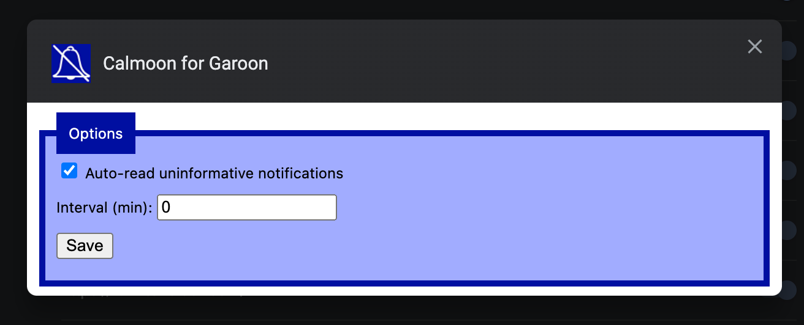

# Calmoon for Garoon  

Disable "Notify this update" when you join/leave event on [Garoon](https://garoon.cybozu.co.jp/) :shushing_face:

For Japanese readers: [README_ja.md](README_ja.md)

## Install

| Chrome                                                                                                                                                                          | Firefox                                                                                                                    |
| ------------------------------------------------------------------------------------------------------------------------------------------------------------------------------- | -------------------------------------------------------------------------------------------------------------------------- | --- |
| [](https://chrome.google.com/webstore/detail/calmoon-for-garoon/adpfpbogonofdljjmipfpheknmadjdck) | [](https://addons.mozilla.org/ja/firefox/addon/calmoon-for-garoon/) |     |

If you need a zip file, please download from [release page](https://github.com/mshrtsr/browser-extension-calmoon/releases).

## Screen shot


## Usage

### Disable "Notify this update" notification

This feature is automatically enabled after installation.

### Auto-read uninformative notifications

Notifications that meet the following rules will be auto-read.

- Notification of schedule modification with an empty body

To use this feature, enable in settings page

- Chrome: Extentions(["`chrome://extensions/`"](chrome://extensions/))->「「Calmoon」」->「Details」->「Options」
- Firefox: Addons(["`about:addons`"](about:addons))->「Calmoon」->「Preferences」

| Option                                | Description                          | Initial value |
| ------------------------------------- | ------------------------------------ | ------------- |
| Auto-read uninformative notifications | Enable/Disable feature               | disabled      |
| Interval                              | Interval of auto-read process (min.) | 5 (min.)      |
| Save                                  | Save current settings                |               |



## Recent updates

# Release v1.2.0 :tada:

## Changes in this Release

### Features

- [New!] Auto-read uninformative notifications
  - To use this feature, see [Usage](#usage) section

### Chores

- Update dependencies

### Release v1.1.0 :tada:

#### Changes in this Release

- Add Japanese localization

### Release v1.0.0 :tada:

#### Changes in this Release

- First release of Calmoon
- This extension disable "Notify this update" when you join/leave event on [Garoon](https://garoon.cybozu.co.jp/)

<!-- ## Usage -->

## Development

```
# setup
$ yarn

# development build
$ yarn start

# production build
$ yarn build
```

## Lisence

This project is licensed under the [MIT license.](./LICENSE)

## Disclaimer

This OSS is my own personal work and does not have any relationship with Cybozu Inc. or any other organization which I belong to.
