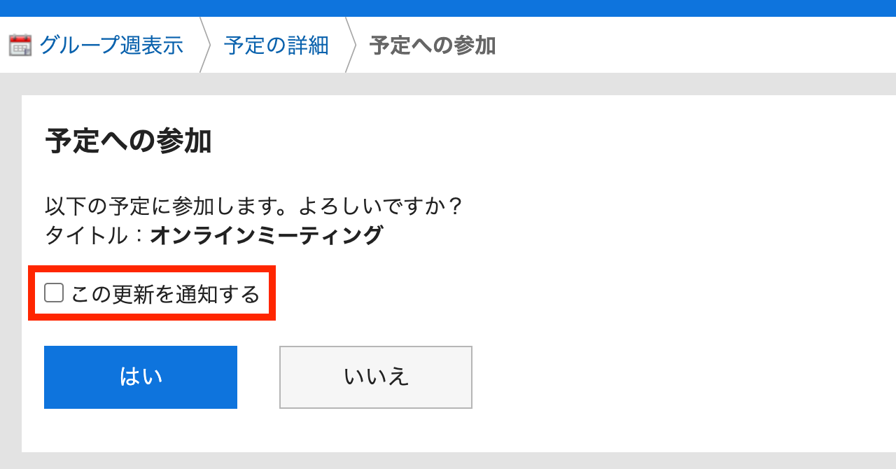
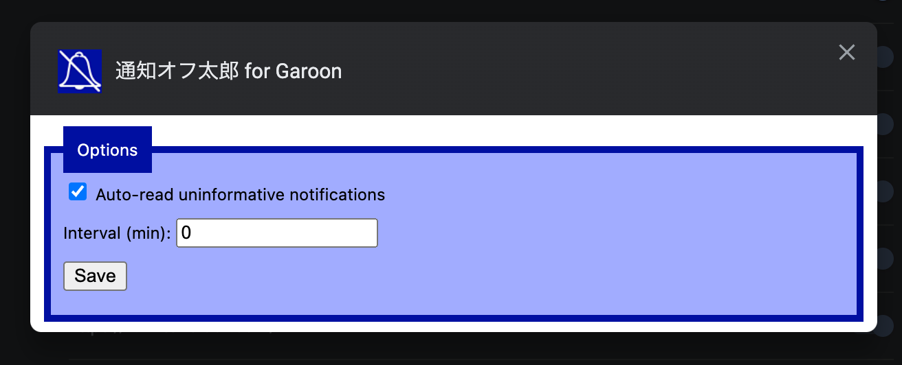

# 通知オフ太郎 for Garoon  

[Garoon](https://garoon.cybozu.co.jp/) の予定に参加/抜けるときの「この更新を通知する」をデフォルトでオフにします :shushing_face:

For English readers: [README.md](README.md)

## インストール

| Chrome                                                                                                                                                                                 | Firefox                                                                                                                           |
| -------------------------------------------------------------------------------------------------------------------------------------------------------------------------------------- | --------------------------------------------------------------------------------------------------------------------------------- |
|  |  |

ZIP ファイルが必要な方は[リリースノート](https://github.com/mshrtsr/browser-extension-calmoon/releases)のページからダウンロードしてください。

## スクリーンショット

## 使い方

### 参加/抜けるときの通知をオフにする機能

Garoon の予定への参加または予定を抜ける画面において、「この更新を通知する」というチェックボックスが自動でオフになる機能です。  
通知オフ太郎をインストールすると自動で有効になります。

### [NEW!] 不要な通知を自動で既読にする機能

Garoon で受け取る通知のうち、以下のルールに当てはまる通知を自動で既読にする機能です。

- 予定変更通知のうち、通知本文が空のもの

この機能を利用するには拡張機能の設定画面から機能を有効化してください

- Chrome: 拡張機能(["`chrome://extensions/`"](chrome://extensions/))->「通知オフ太郎」->「詳細」->「拡張機能のオプション」
- Firefox: アドオンマネージャー(["`about:addons`"](about:addons))->「通知オフ太郎」->「設定」

| オプション名                          | 説明                     | 初期値  |
| ------------------------------------- | ------------------------ | ------- |
| Auto-read uninformative notifications | 機能を有効化するかどうか | オフ    |
| Interval                              | 既読処理の実行間隔（分） | 5（分） |
| Save                                  | 設定を保存します         |         |

## アップデート

### リリース v1.2.0 :tada:

#### 新機能・機能改善

- [NEW!] 不要な通知を自動で既読にする機能を追加しました。
  - 使い方は上記の「[使い方->不要な通知を自動で既読にする機能](#不要な通知を自動で既読にする機能)」をご参照ください

#### 軽微な修正

- 依存ライブラリを更新しました

### リリース v1.1.0 :tada:

#### 変更点

- 日本語対応を行いました。

### リリース v1.0.0 :tada:

#### 変更点

- 通知オフ太郎（英語名：Calmoon）をリリースしました。

## ライセンス

当プロジェクトのライセンスは [MIT ライセンス](./LICENSE)の規約に基づいて付与されています

## 免責事項

この OSS は、私個人の著作物であり、サイボウズ株式会社、その他、私の所属する組織とは一切関係ありません。
